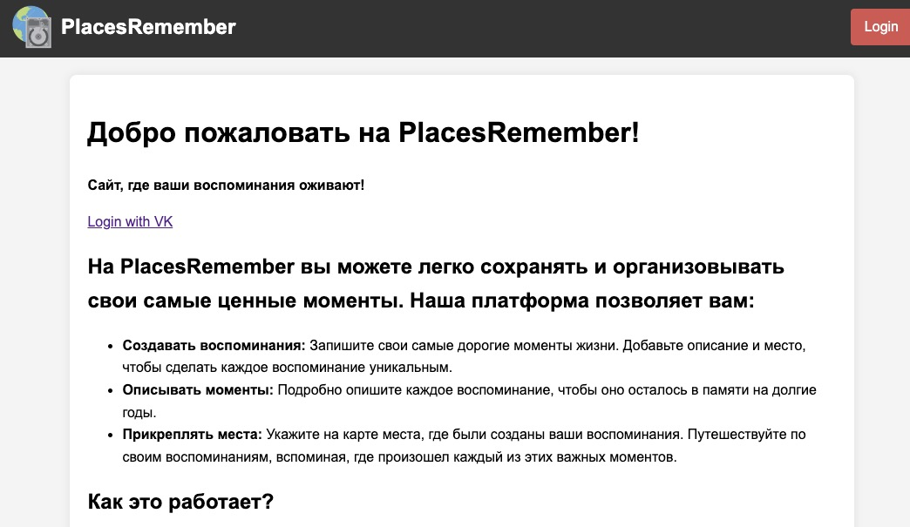
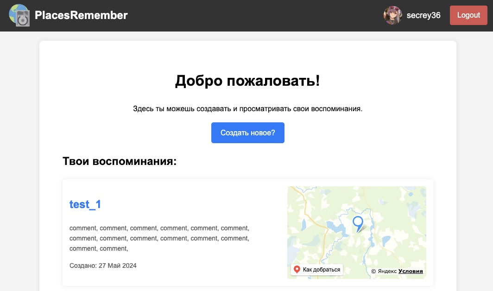
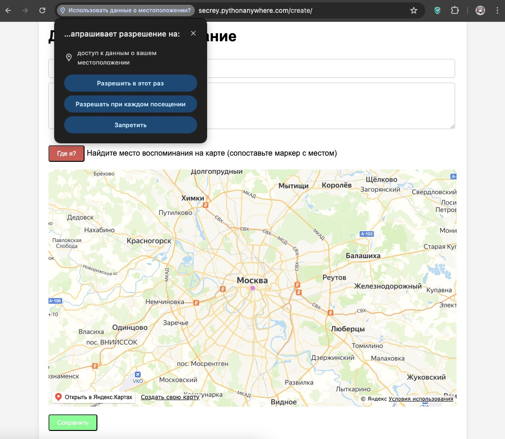

# placesremember
test task for practice

!Try Here!: https://secrey.pythonanywhere.com/

Про взаимодействие с сервисом:

Встреча нового пользователя, предложение залогиниться с использованием VK

Ваш дешборд:

Feature: можно телепортировать метку на свое текущее местоположение!

TODO: При хостинге метки на карте стали вести себя неадекватно, в локальном запуске все отрабатывает как положено (причина еще неизвестна, в JS уходят и приходят корректные координаты)
